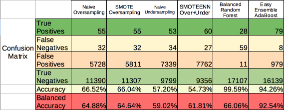
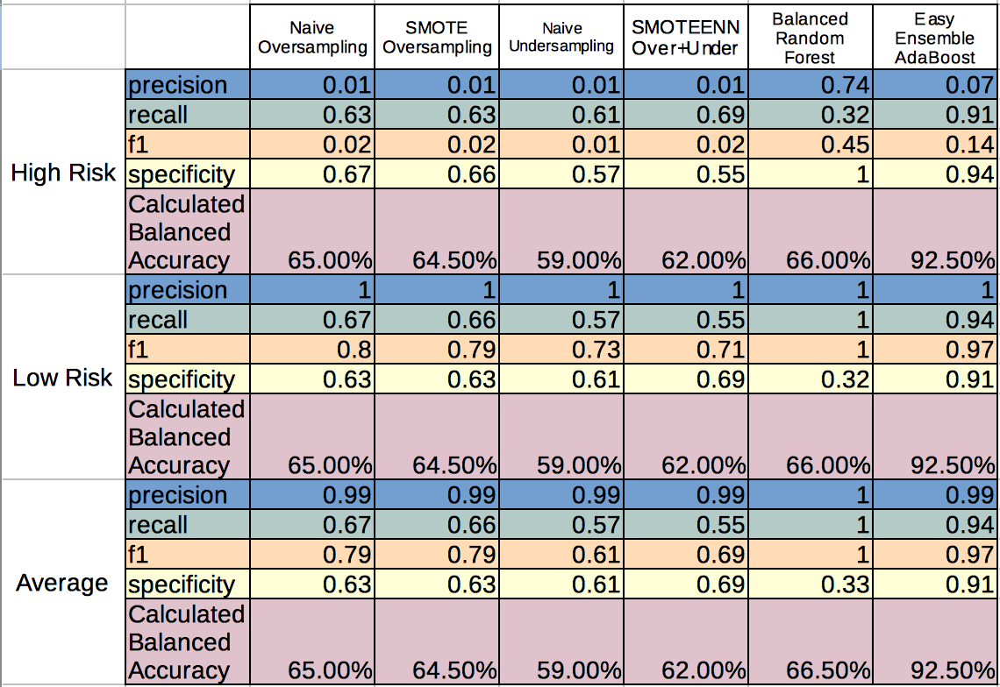

# Credit Risk Analyzing

We have been tasked to use supervised machine learning models to comb over credit card data from LendingClub and see if credit risk can be adequately predicted. Since it's more likely to come across low-risk loans than high-risk loans, the credit card data will be unbalanced in favor of low-risk loans. While we would prefer dealing with better balanced datasets, for this task, we will go ahead with resampling methods to tackle credit risk.

## Initial Preparations
With access to a local csv file with the LendingClub data, we were able to import and transform the data needed for our analysis. In particular, with the get_dummies() method, we split columns of input string data into separate columns, each with binary integers to stand for true and false. Key to adjusting our machine learning model is the loan_status column, where we called 'current' loans 'low-risk' and the tardy loans – late, defaulted, or in grace period – 'high-risk'. This result column will be stored in our dependent y variable and excluded from our independent x variable, which will instead house the rest of the input data. For each sampling method that we import, we will set the random_state value to 1. Once we get our results, we'll calculate both accuracy and balanced accuracy based on confusion matrix results and with reference to a relevant "Balanced Accuracy" article by Motunrayo Olugbenga (2021).
Source: https://neptune.ai/blog/balanced-accuracy

## Confusion Matrix and Accuracy Results

Looking at the confusion matrices, each model generated relatively high quantites of true negatives and comparatively low quantities of false negatives and true positives. Regarding false positives, four of the six models – naive oversampling, naive undersampling, SMOTE, and SMOTEENN – we used generated a sizeable portion of false positives (at least 5,000), which certainly casts doubt on those models' prediction abilities. The two exceptions, balanced random forest and easy ensemble, showed significantly less false positives (at most 979). More impressively, those two methods have managed to predict more true negatives than other methods. As for base accuracy and balanced accuracy score figures, the aforementioned four models intriguingly don't boast passing scores for either form of accuracy. Meanwhile, the two aforementioned exception models perform better accuracy-wise, although balanced random forest notably lags behind easy ensemble in terms of balanced accuracy. Undoubtedly, the easy ensemble model's two 90+% accuracy figures help distinguish the model's performance from its rivals.

## Classification Report Figures
While low risk predictions are easily covered by balanced random forest and easy ensemble, we still want to evaluate how well each model predicts the unlikely high risk loans:

Right away, just from skimming through the classification report table, we see that easy ensemble has a dismal precision rate of 0.07, which is backed up by easy ensemble getting so many of its positive predictions wrong (only 79 out of 1058 predictions were correct). 
Going back to easy ensemble's accuracy figures, we see that easy ensemble is blessed not only with a plethora of "true" predictions but also 16,000+ true negatives and 8 false negatives that help inflate the recall and specificity rates. In turn, these two high rates lead to a high balanced accuracy score, per the definition of balanced accuracy shared by Ms. Olugbenga ("Balanced Accuracy", 2021). Moreover, despite easy ensemble managing to achieve the most true positives (79) out of any model, the 979 false positives indicate that the model reaches this milestone by aggressively flagging many loans as positively high-risk. Should any lending firm use our easy ensemble model to decide on loans, all factors considered, then those firms will surely end up missing out on many good-intentioned borrowing customers.

By contrast, the balanced random forest model is more reasonable scouting for potential high risk loans. Although this model does not capture many actual high risk loans (only 28 out of 87 high risk loans were detected), it nevertheless is fairly precise with those high risk calls (28 true positives versus only 11 false negatives). In addition, this model has the highest F1 score for high-risk loans – 0.45, as opposed to 0.14 from easy ensemble and lower for the other models. Granted, 0.45 is still a bit low for an F1 score, where 1 is the ideal value ("17.4", 2021). Plus, the model's 0.32 specificity rate for low-risk loans is a discouraging sign of missing out on some actual low-risk loans. However, considering the dataset's largely low-risk class imbalance, the balanced random forest model clearly makes the most out of the tiny high-risk population of loans, making reasonably precise high risk predictions that a lending firm would surely consider looking at.

## Conclusion
Our findings show that the balanced random forest and easy ensemble models stand out from the pack. Which one is the better model, though, is a matter of how one prioritizes predictions of high-risk loans. On one hand, the easy ensemble model gets the majority of its calls right, albeit painting many otherwise low-risk loans as high-risk. On the other hand, the balanced random forest is more precise with its high-risk calls, but it can miss out on both actual low-risk loans and actual high-risk loans. Definitely, it's not unreasonable to bank on your largely low-risk borrowers if their impact outnumbers that of several high-risk borrowers. Still, in a more risky environment where many customers and investors are taking out big loans they are less likely to pay back, especially when the economy takes a downturn, it would perhaps behoove lending firms to more seriously detect high-risk borrowers and stop any runaway speculative lending from snowballing.
